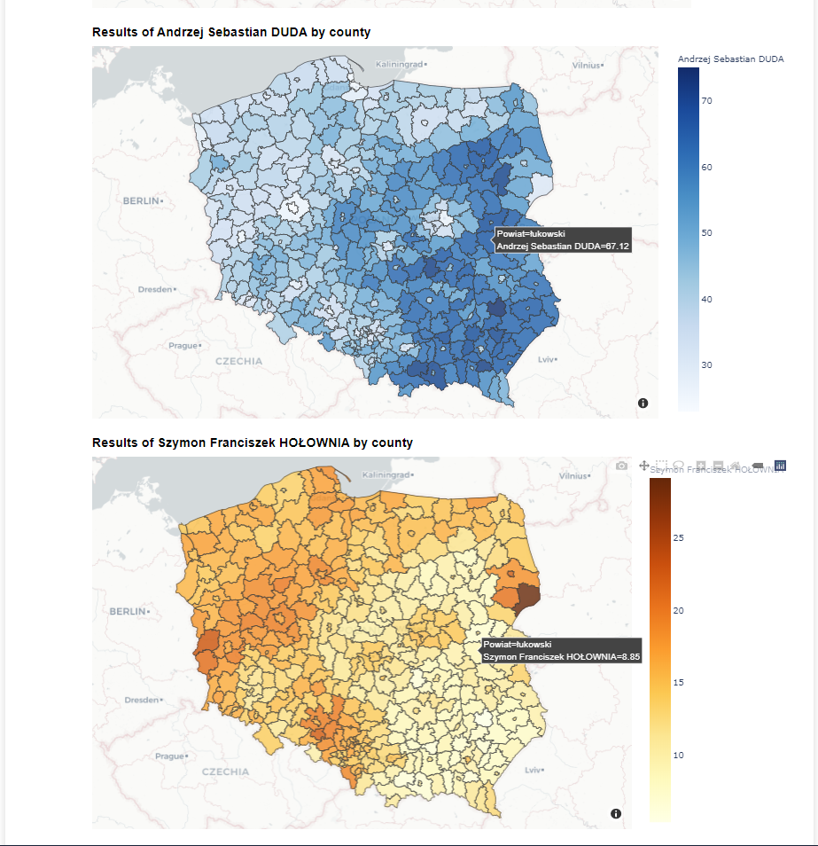
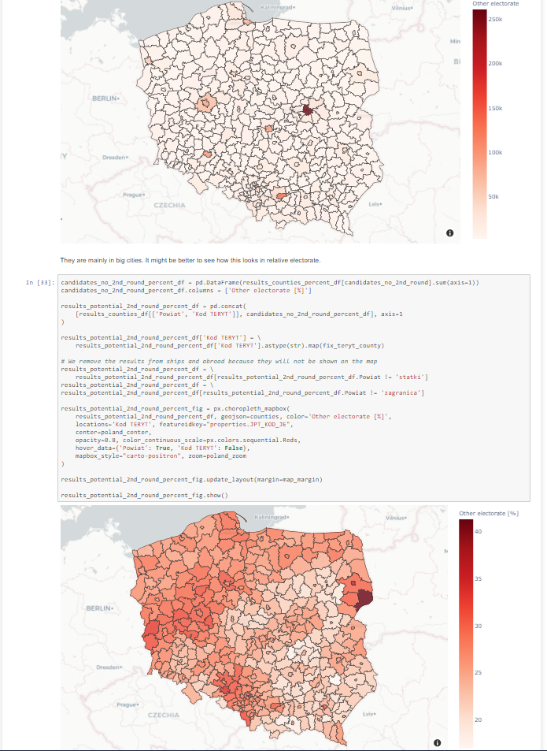
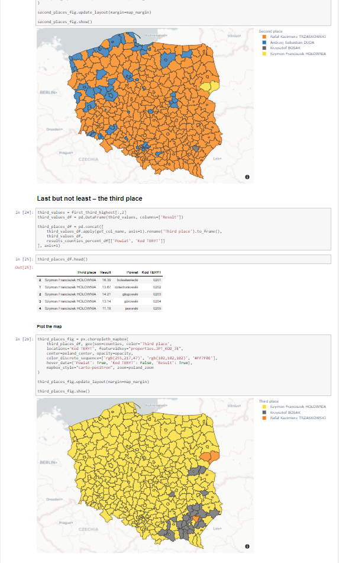
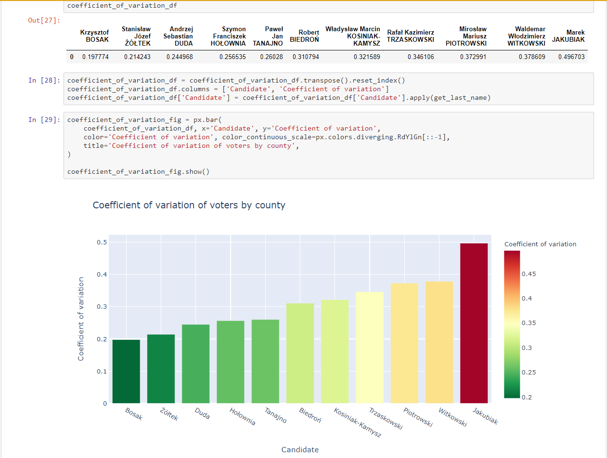
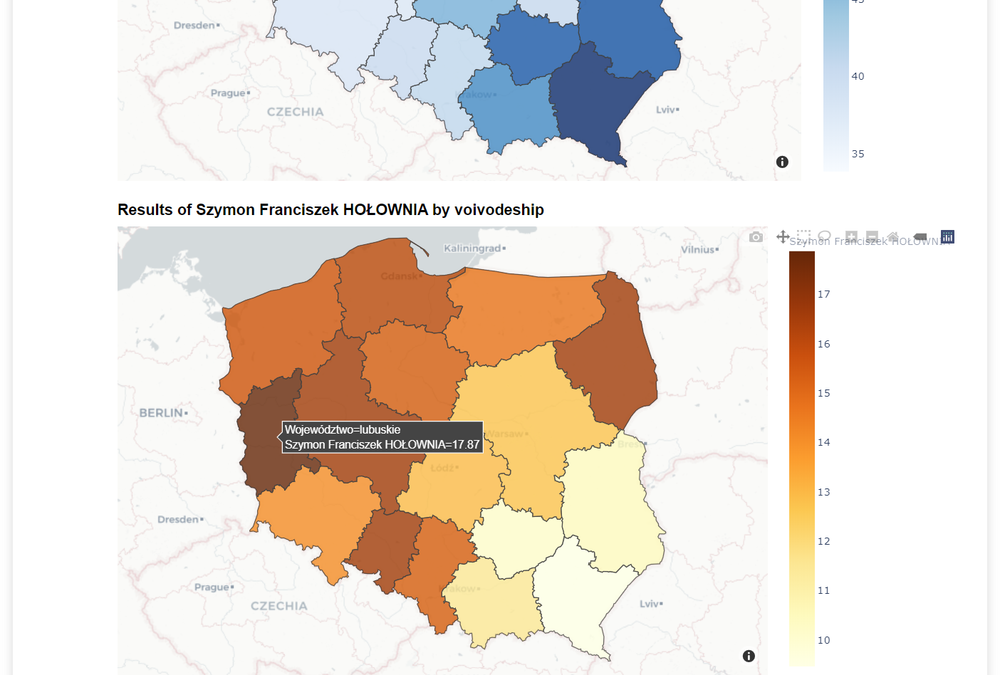
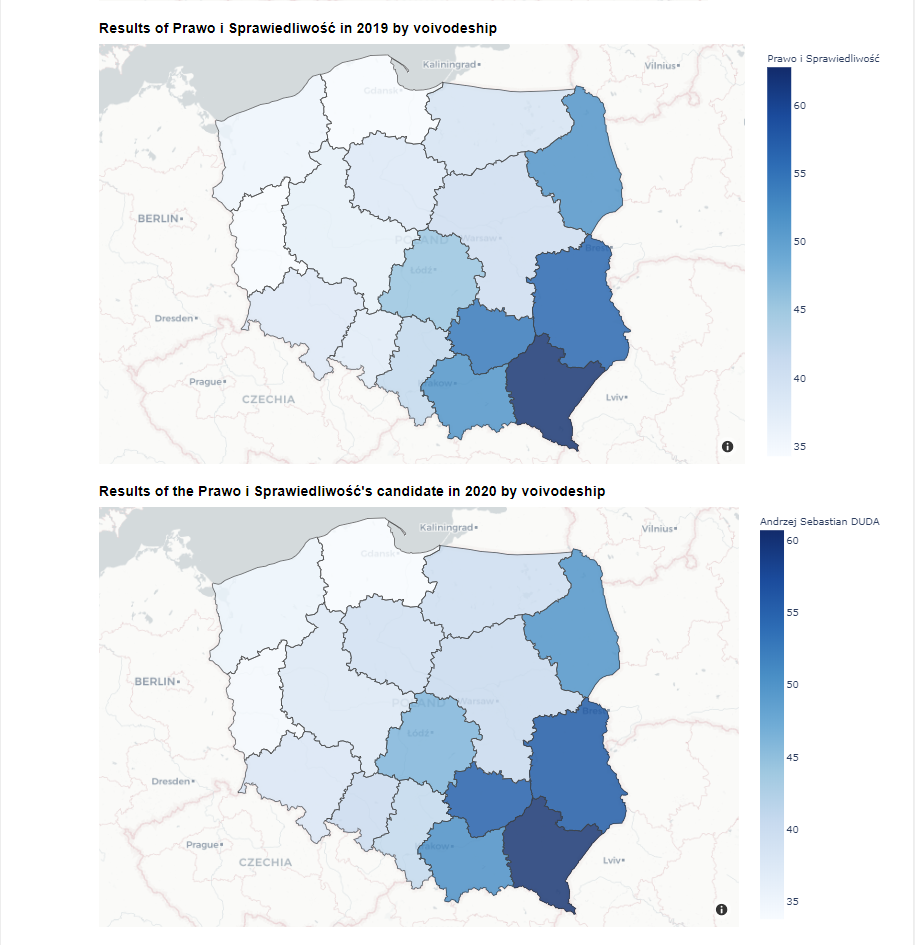

# Analysis of the presidential election
My own analysis of the first round of the 2020 Polish Presidential Election on June 28th. I love interactive maps and charts and I have used them quite extensively throughout the analysis.

## Website
If you do not want to clone the repository and Jupyter, you can see the results of the analysis at https://dzionek.github.io/pl-pres-election-2020.

## Parts
The analysis consists of three parts:
* *Analysis.ipynb* – Introduction to the topic, a brief information about candidates, counting the total results and displaying them on charts (also as a percentage).
* *Counties.ipynb* – County-level analysis. Vote concentrations for each candidate on a map. Who got the first, second, and third result in each county. Who is the candidate with the most equally spread electorate? Where are the voters who do not have their candidate in the second round? Where the two promoted candidates should do their campaing before the second round?
* *Voivodeships.ipynb* – Voivodeship-level analysis. Vote concentration for each candidate on a map. Who was the winner in each voivodeship? Is the distribution of votes similar to the one from the last elections?

## Installation
Use the package installer [pip](https://pypi.org/project/pip/) to install all python dependencies.
```bash
python -m pip install --upgrade pip
pip install -r requirements.txt
```

## Usage
Open *Analysis.ipynb* in [Jupyter Notebook](https://jupyter.org).
```bash
jupyter notebook Analysis.ipynb
```

There are links to *Counties.ipynb* and *Voivodeships.ipynb* inside the *Analysis.ipynb* file, so you do not need to care about manually opening these two files.

Since it is easier to upload smaller files to Github, I have cleaned the output of *Counties.ipynb*. Click "Kernel > Restart & Run All" to show its output.

## Screenshots

<p align="center">
  <br>
  <b>Fig. 1</b> &nbsp Vote concentration by county.
</p>

<br><br>

<p align="center">
  <br>
  <b>Fig. 2</b> &nbsp Where are the voters without their candidate in the second round?
</p>

<br><br>

<p align="center">
  <br>
  <b>Fig. 3</b> &nbsp Who got the second and third place in each county?
</p>

<br><br>

<p align="center">
  <br>
  <b>Fig. 4</b> &nbsp Who is the most equally supported among Polish counties?
</p>

<br><br>

<p align="center">
  <br>
  <b>Fig. 5</b> &nbsp Vote concentration by voivodeship.
</p>

<br><br>

<p align="center">
  <br>
  <b>Fig. 6</b> &nbsp Comparison with the elections in 2019.
</p>
